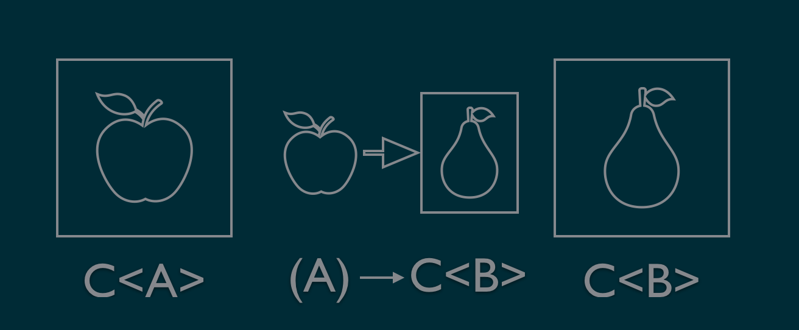
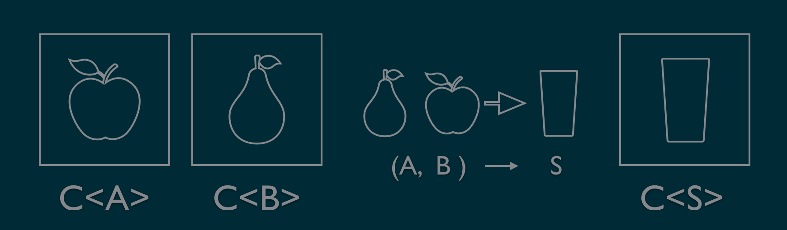

<!--s-->
# FP with Arrow
FP Community 2020

<!--s-->
# Intro

<!--v-->
## Ziel des Vortrags
> Mit Hilfe der Kotlin Library Arrow und einem kleinen Beispiel Lust auf funktionale Programmierung machen.

<!--v-->

## Was bietet Kotlin
* Nah an Java
* Funktionen sind first class cititzens
* echte Funktionstypen
* Typinference
* Extension methods

Note:
* Im Vergleich dazu hat Java SAM Types "single abstract method"

<!--v-->
## Was fehlt Kotlin
* Sprach-Features
    * Higher Kinded Types/Generics
    * Typ-Klassen
* Library-Features
    * Funktionen zur Komposition
    * Funktionale Datentypen
    * Abstraktionen (Functor, Monad, etc.)

<!--v-->
## Was ist Arrow
* Sammlung funktionaler Libs für Kotlin
* Fusion aus KATEGORY und funKTionale
* Erstes Release 2018
* [Thoughtworks Tech Radar](https://www.thoughtworks.com/radar/languages-and-frameworks?blipid=201904040): Kategorie Trail

Note:
Trail bedeutet: Die Technologie ist es wert, verfolgt zu werden. 
Es ist wichtig zu verstehen, wie das Framework eingesetzt werden kann. 
Unternehmen sollten diese Technologie an einem Projekt ausprobieren, das das Risiko handhaben kann.

<!--v-->
## Was bietet Arrow
* Arrow-Core: Funktionale Std-Lib (Basis)
    * Higher Kinded Types 
    * Typ-Klassen
    * Basis Funktionen
    * Funktionale Datentypen (`Option`, `Either`, `ListK`...)
* Arrow-Fx: Library für funktionale Effekte
* Arrow-Optics: Transformation von immutable Daten
* Arrow-Meta: Meta-Programming Library

Note:
Ein Funktionaler Effekt ist ein immutable Datentyp der die Berechnung von Werten beschreibt wobei die Berechnung
zusätzliche Features wie z.B. Optionalität, Logging, Errors, State oder input/output benötigt

<!--s-->
# Case study

<!--v-->
## Validierung 
* Zwei Strings für Name und Alter sollen in ein User-Objekt tranformiert werden
* Folgende Bedingungen müssen erfüllt sein:
    * Name darf nicht leer sein
    * Alter muss eine positive Zahl >= 18 sein.
* Falls eine Validierung nicht erfüllt wird soll dies als Fehlertext zurückgegeben werden

<!--v-->
## Beispiel

```kotlin
val map = mapOf("name" to "Adam", "age" to "18")
readUser(map) // User(name=Adam, age=18)

val map = mapOf("name" to "", "age" to "18")
readUser(map) //name cannot be blank

val map = mapOf("name" to "", "age" to "17")
readUser(map) //name cannot be blank, age must be greater than 17  
```
<!--v-->
## Either Datentyp
Wird verwendet, um einen Wert darzustellen, der entweder korrekt oder fehlerhaft ist.
Nach der Konvention wird der `Left` Konstruktor verwendet, um einen Fehlerwert zu halten. 
Der `Right` Konstruktor wird verwendet, um einen korrekten Wert zu halten.

```kotlin
sealed class Either<out E, out A> {
    data class Left<out E>(val value: E): Either<E, Nothing>()
    data class Right<out A>(val value: A): Either<Nothing, A>()
}
```
<!--v-->
## Code - Validierungs Funktionen
```kotlin
fun getValue(key: String, data: Map<String, String>): Either<NonEmptyString, String> =
    data.get(key).rightIfNotNull 
        { NonEmptyString("$key field not specified")}

fun nonBlank(attribute: String, data: String): Either<NonEmptyString, String> =
    Either.cond(data.isNotBlank(),
        { data },
        { NonEmptyString("$attribute cannot be blank") })

fun parseInt(attribute: String, data: String): Either<NonEmptyString, Int> =
    Either.cond(data.matches(Regex("\\d+")),
        { data.toInt() },
        { NonEmptyString("$attribute must be an Int") })

fun greaterThan(min: Int, attribute: String, data: Int): Either<NonEmptyString, Int> =
    Either.cond(data > min,
        { data },
        { NonEmptyString("$attribute must be greater than $min") })
```
<!--v-->
## Fail Fast Validierung
Bei der Konvertierung des eigelesenen Strings in `name` oder `age` soll bei 
Nichterfüllung einer Validierungsregel sofort abgebrochen werden

<!--v-->
## Sequenzielle Verarbeitung - FlatMap
```kotlin
fun <E,A,B> Either<E,A>.flatMap(f:(A)->Either<E,B>): Either<E,B>
```



<!--v-->
## Code - Fail Fast Validierung
```kotlin
fun readName(data: Map<String, String>): Either<NonEmptyString, String> =
    getValue("name", data)
        .flatMap { nonBlank("name", it) }

fun readAge(data: Map<String, String>): Either<NonEmptyString, Int> =
    getValue("age", data)
        .flatMap { nonBlank("age", it) }
        .flatMap { parseInt("age", it) }
        .flatMap { greaterThan(17, "age", it)
    }
```

<!--v-->
## Validated Datentyp
Ist im Prinzip aufgebaut wie Either. Bietet jedoch eine Applicative Instanz, die die 
Semigroup Eigenschaft für den Fehlertyp verwendet.

```kotlin
sealed class Validated<out E, out A> {
  data class Invalid<out E>(val e: E) : Validated<E, Nothing>()
  data class Valid<out A>(val a: A) : Validated<Nothing, A>()
}
```
Konvertierung
```kotlin
  val nameValidated = Validated.fromEither(readName(data))
  val ageValidated = Validated.fromEither(readAge(data))
```
<!--v-->

## Semigroup und Applicative
* Die Semigroup Eigenschaft benötigen wir um die Fehlermeldungen aneinander zu hängen.
* Die Applicative Eigenschaft benötigen wir um die Validierungen für Name und Alter parallel machen zu können.
<!--v-->

## Was ist eine Semigroup
Eine _Semigroup_ ist eine Typ-Klasse mit einer binären Operation `combine` die assoziativ ist.

```Kotlin
interface Semigroup<A> {
  /**
   * Combine two [A] values.
   */
  fun A.combine(b: A): A
}
```
<!--v-->
## Semigroup Instanz
```kotlin
data class NonEmptyString(val value:String){
    init {
        check(value.length >=1) {"NonEmptyString cannot be empty"}
    }
    companion object
}

@extension
interface NonEmptyStringSemigroup : Semigroup<NonEmptyString> {
    
    override fun NonEmptyString.combine(b: NonEmptyString): NonEmptyString =
        NonEmptyString("${this.value}, ${b.value}")

}

```
<!--v-->

## Was ist ein Applicative Functor 
Ein Applicative Functor ist eine Type-Klasse die es erlaubt zwei Funktionen 
unabhängig voneinander auszuführen.

```kotlin
interface Applicative<F> : Functor<F> {

    fun <A> just(a: A): Kind<F, A>
    
    fun <A, B, C> Kind<F, A>.map2
        (fb: Kind<F, B>, f: (A, B) -> C): Kind<F, C>

}
```
Der Typ `Validated` ist ein Applicative Functor

<!--v-->
## Fail Slow Validierung
Die Validierungen für `name` und `age` sollen getrennt erfolgen. D.h. tritt ein Validierungsfehler z.B. bei `name` auf 
soll trotzdem die Validierung für `age` durchgeführt werden.

<!--v-->
## Parallele Verarbeitung - map2
```kotlin
fun <A, B, E, S> Validated<E, A>.map2
    (fb: Validated<E, B>, f: (A, B) -> C): Validated<E, S>
```


<!--v-->
## Code - Fail Slow Validierung

```kotlin
fun readUser(data: Map<String, String>): Validated<NonEmptyString, User> {
    val nameValidated = Validated.fromEither(readName(data))
    val ageValidated = Validated.fromEither(readAge(data))
    
    Validated.applicative(NonEmptyString.semigroup()).run {
        return nameValidated.map2(ageValidated){(name, age) -> User(name, age) }.fix()
    }
}
```
<!--s-->
# Zusammenfassung
<!--v-->

## Was hat man gewonnen
* Unabhängige Validierungs-Funktionen, die sich beliebig kombinieren lassen
* Algorithmus ist relativ unabhängig vom Ergebnis und Fehlertyp

Note: 
* Austausch von NonEmptyString zu NonEmptyList
* Man kann Funktionen erstellen, die ein (durch eine Typklasse definiertes) Verhalten abstrahieren 
und es dem Aufrufer überlassen, auf welchen Datentyp er es anwenden möchte.
<!--v-->

## Mein Eindruck
* Funktioniert gut, wenn man die bestehenden Konstrukte verwendet
* Simulation von Typklassen und Higher Kinded Types etwas sperrig
* Code-Generierung macht manchmal Probleme
    * Typklassen und Implementierungen müssen in unterschiedliche Module
    * Typklassen können für einen Typen nur einmal instanziiert werden

<!--v-->
## Lust auf mehr?
* The Red book (https://www.manning.com/books/functional-programming-in-scala)
* Study Group - Advanced FP im April

<!--v-->

## Referenzen
* https://www.manning.com/books/functional-programming-in-scala
* https://arrow-kt.io/docs/core/
* https://jorgecastillo.dev/kotlin-fp-does-it-make-sense

<!--v-->

# Dankeschön :)
<!--v-->

<!-- s -->
# Backup

<!--v-->

## Wieso FP
* Next Step in der Software-Entwicklung
* Qualität ++
    * Code ist einfacher zu verstehen
    * Keine Seiteneffekte
    * Bessere Wartbarkeit
    * Einfacher testbar
* Per se parallelisierbar

<!--v-->

## Higher Kinded Types
```kotlin
interface List<A> {
    fun <A, B> List<A>.map(f: (A) -> B): List<B>
}// Type vom Kind *

interface Functor <F> {// Type vom Kind (* -> *) -> Constraint
    fun <A, B> <F<A>>.map(f: (A) -> B): <F<B>>
}

interface Functor <F> {
    fun <A, B>Kind<F, A>.map(f: (A) -> B): Kind<F, B>           
}


```


## Typ Klassen
Etwas wie ein Interface jedoch oft auf höheren Abstraktionsniveau. 
Eine Typklasse beschreibt eine algebraische Struktur
